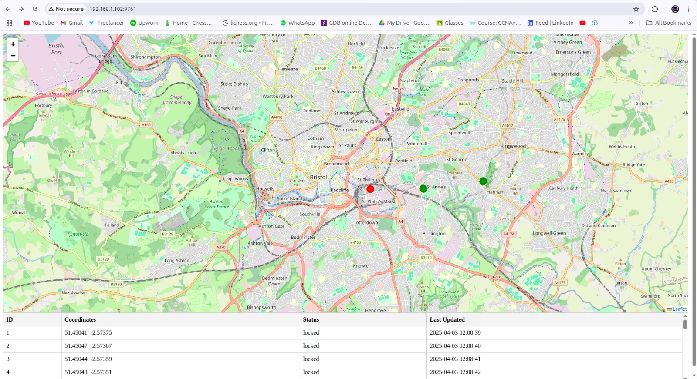
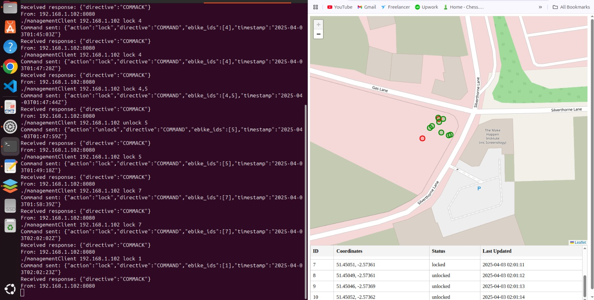

README

Development Process:

This project is developed as worksheet 2 of IoT 2425 course. IT requires implementing a GPS-based monitoring system(in C++) and UDP communication.
Project Structure:
 The project structure i've implemented follows the worksheet requirements(web, html,util,sr, directories and the other directories)
 -eBike logic was implemented in eBikeClient.cpp.
 -Gateway proccesing is done in ebikeGateway.cpp
 -locking of separate client is done in managementClient.cpp
 -CSV data is stored in /data
 -Makefile for builed process
The Project was divided into 3 activities(The third activity is this README document):

Activity 1: GPS data simultation(on map)

In this activity we simulate the ebike location tracking by the use of a UDP client server model. The ebikeClient.cpp read the GPS coordinates(from a CSV file) and send them on the UDP to the ebikeGateway. The messages are formatted in JSON(which includes the eBike ID, timestamp,GPS coordinates)
The ebikeGateway uses the socketserver to listen for messages
Messagehandler parses the messages and store them in GeoJSON format, and then sent via HTTP using poco web server. 
The (map.html) reloads the data every 5 seconds to update both the table and the map.

Activity 2:
part 1(Basic): extended the ebikeclient and ebikegateway to transmit the lock status via the UDP, which make the map and table work in real time(green/unlocked,red/locked)
Part 2(Enhanced) : a separate client is added(managementCleint.cpp) which enables to send maintenance status using COMMAND protocol. the gateway parses the action recieved and update the entries. to run it in the command-line :  ./managementClient <gateway IP> lock 1,2 (which locks bike 1 and 2)

Challenges and Solutions:
-fixed an issue in map.html, marker wasn't chaning it color continuiuosly unless if the page is refreshed, so i ensured that fetchEbikes() logic replaces the marker color every cycle.
-Synchronization issue solved by using std::mutex with lock_gaurd to prevent race conditions  when updating the shared geoJson.
-when running several ebikes csv files without adjusting the starting ebike_id the markers n the map were overwritten, so the solution was to mannually adjust the starting_id in the command line at each time.

Learnings:
-Gained practical experience in working with UDP sockets, JSON and GeoJson formats and integrating C++ with frontend map .
-Compiling  with g++,linked with poco libraries

Acknowledgement of GenAI Tools
-ChatGpt was used for suggestion on how to make the map update the marker color live(continuously)
-Used for some debugging compiler errors.

